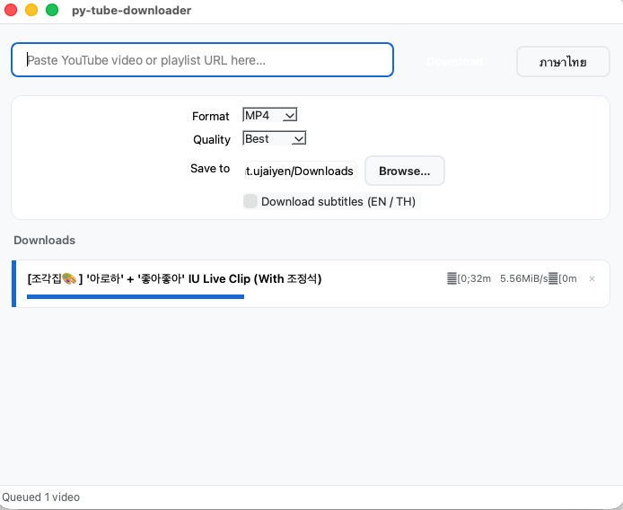

# py-tube-downloader

A Python desktop application for downloading YouTube videos, with quality selection, real-time progress, and subtitle support.



---

## Features

### Phase 1 — Core (available now)
- Download a YouTube video by URL
- Quality selection: Best, 1080p, 720p, 480p, 360p (up to **4K / 2160p**)
- Output format: **MP4** (video) or **MP3** (audio)
- Choose destination folder
- Subtitle download (EN / TH)
- Real-time progress bar + download speed per item
- Up to 3 concurrent downloads
- Cancel individual downloads
- Language toggle: **English / ภาษาไทย** (persisted across sessions)

### Phase 2 — Planned
- Support for other platforms (Facebook, TikTok, …)
- Built-in file converter
- Bandwidth throttle mode

---

## Tech Stack

| Layer | Technology |
|---|---|
| Language | Python 3.11+ (3.9 minimum) |
| Download engine | [yt-dlp](https://github.com/yt-dlp/yt-dlp) — `android_vr` client |
| GUI | PyQt6 |
| Audio muxing | ffmpeg (system binary) |
| Linting / formatting | ruff |
| Testing | pytest |

> **Why `android_vr`?** YouTube's 2024 PO-token enforcement blocks the `android` and `ios` clients for adaptive streams. The `android_vr` client returns the full format list (144p – 2160p) without requiring GVS PO tokens, enabling high-quality downloads without any authentication.

---

## Requirements

- Python 3.9 or higher
- `ffmpeg` — required for merging video + audio and MP3 extraction

### Install ffmpeg

| OS | Command |
|---|---|
| macOS | `brew install ffmpeg` |
| Ubuntu / Debian | `sudo apt install ffmpeg` |
| Windows | Download from [ffmpeg.org](https://ffmpeg.org/download.html) and add to PATH |

---

## Installation

```bash
git clone https://github.com/your-username/py-tube-downloader.git
cd py-tube-downloader
python3 -m venv .venv
source .venv/bin/activate
pip install -r requirements.txt
```

---

## Usage

```bash
./run.sh          # auto-creates venv on first run
# or
python3 main.py
```

1. Paste a YouTube video URL
2. Select quality and format
3. Choose output folder
4. Click **Download**

---

## Project Structure

```
py-tube-downloader/
├── main.py                          # Entry point
├── run.sh                           # One-command launcher
├── requirements.txt
└── src/
    ├── downloader.py                # yt-dlp wrapper + QThread worker
    ├── playlist.py                  # Playlist metadata fetching
    ├── i18n.py                      # EN/TH translation manager
    └── gui/
        ├── app.py                   # MainWindow
        ├── theme.py                 # QSS stylesheet + color tokens
        └── components/
            ├── progress_bar.py      # Per-download card widget
            └── settings_panel.py   # Format/quality/folder controls
    └── utils/
        ├── file_manager.py          # Filename sanitize + path builder
        └── config.py                # Persistent settings (JSON)
```

---

## Development

```bash
pytest              # run tests
ruff check .        # lint
ruff format .       # format
```

---

## License

MIT

